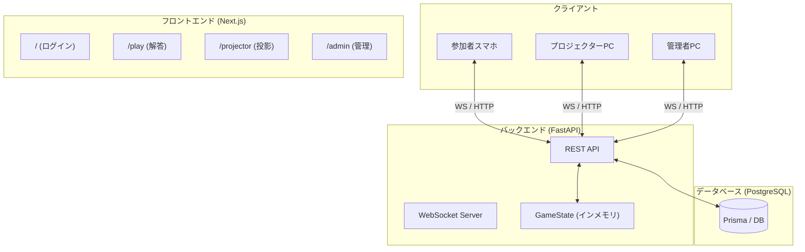

# アーキテクチャ設計書

## 1. システム構成図

## 2. 特徴的な設計方針

### 2.1. ルームベースのセッション管理
従来の固定パスコード方式から、**「部屋(Room)単位」** の管理へ刷新しました。
- 管理者が部屋を作成するたびに、すべての解答履歴やチーム情報がリセットされ、新しいセッションが開始されます。
- これにより、大会ごとにデータをクリーンな状態に保つことができ、開発・テストの繰り返しも容易になりました。

### 2.2. 2段階の解答フロー (倍率 -> 解答)
UX向上と戦略性を高めるため、参加者の解答画面を2ステップに分離しました。
1. **倍率選択フェーズ**: 自信に応じて `x1`, `x2`, `x3` を選択。
2. **解答選択フェーズ**: 4択（A〜D）を選択。
各チームには大会を通じた `x3` (1回), `x2` (2回) の制限があり、バックエンドで厳密にバリデーションされています。

### 2.3. インメモリ状態とDBのハイブリッド管理
- **インメモリ (`quiz_state.py`)**: 現在の問題ID、進行フェーズ（待機、解答中など）、現在の部屋ID。高速な同期が必要なデータ。
- **データベース (`PostgreSQL`)**: 永続化が必要なチーム情報、スコア、解答履歴、問題データ。

## 3. インフラ・デプロイ構成
- **Frontend**: Vercel
- **Backend**: Render (WebSocket維持のため)
- **Database**: Supabase / Render Managed PostgreSQL
- **Build Pipeline**: GitHub Actions / Render Build Command (`build.sh`) により、デプロイ時に自動的にPrisma Clientの生成とDBマイグレーションが行われます。