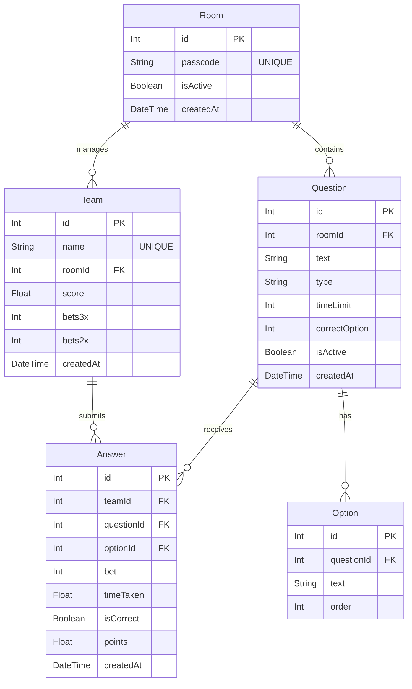

# データベース設計書 (ER図・テーブル定義)

## 1. ER図

## 2. テーブル定義

### 2.1. `Room` モデル
大会ごとのセッションを管理します。

| カラム名 | 型 | 説明 |
| :--- | :--- | :--- |
| `id` | Int | PK |
| `passcode` | String | 入室用パスコード（管理者画面で発行） |
| `isActive` | Boolean | 現在使用中の部屋かどうか |

### 2.2. `Team` モデル
参加チーム情報を保持します。

| カラム名 | 型 | 説明 |
| :--- | :--- | :--- |
| `id` | Int | PK |
| `name` | String | チーム名 |
| `roomId` | Int | 紐づく部屋ID |
| `score` | Float | 累計ポイント |
| `bets3x` | Int | 3倍ベットの残り回数 (初期値: 1) |
| `bets2x` | Int | 2倍ベットの残り回数 (初期値: 2) |

### 2.3. `Question` モデル
クイズ問題マスター。

| カラム名 | 型 | 説明 |
| :--- | :--- | :--- |
| `id` | Int | PK |
| `roomId` | Int | 紐づく部屋ID |
| `text` | String | 問題文 |
| `type` | String | `"normal"` または `"majority"` |
| `correctOption`| Int | 正解の選択肢番号 (1-4) |

### 2.4. `Answer` モデル
解答履歴。

| カラム名 | 型 | 説明 |
| :--- | :--- | :--- |
| `bet` | Int | 倍率 (1, 2, 3) |
| `timeTaken` | Float | 解答にかかった時間 (秒) |
| `points` | Float | この解答で獲得（または失った）ポイント |